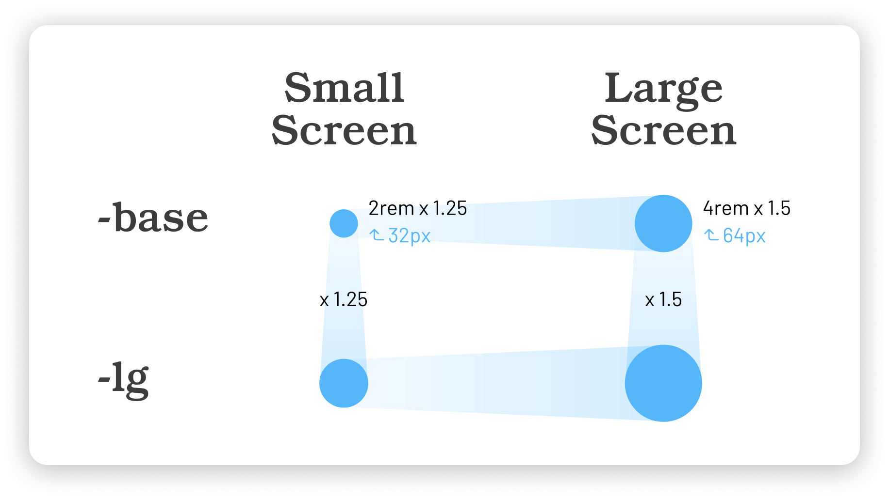

# Fluid Typography

S2 Framework has adopted the modern concepts of **Fluid Typography** and **Type Scale**, which makes it **Fluid Type Scale**. &#x20;

The fluid behavior is effectively achieved using `clamp()` in the font-size property, allowing text to scale dynamically based on the viewport size. And by adopting a type scale ratio, we can ensure smooth, consistent typography that maintains visual harmony across different screen sizes without guesswork.

To take advantage of both, we can use the open-source tool [**Fluid Type Scale Calculator**](https://www.fluid-type-scale.com) to generate all the `clamp()` values we need effortlessly.


If you think the default font size in the S2 Cloneable is fine and you don't have to make any changes yet, you can skip this chapter.



## The Concept

Once you understand the concept, you can use the tool to adjust the values to fit your design needs easily. Let's take a look at the diagram below:

<figure><figcaption><p>The Concept of Fluid Type Scale</p></figcaption></figure>

The above diagram explains the basic concept of this example: [2-step Fluid Type Scale](https://www.fluid-type-scale.com/calculate?minFontSize=32\&minWidth=360\&minRatio=1.25\&maxFontSize=64\&maxWidth=1280\&maxRatio=1.5\&steps=base%2C+lg\&baseStep=base\&prefix=_text---hero-title-\&useContainerWidth=false\&includeFallbacks=false\&useRems=true\&remValue=16\&decimals=3\&previewFont=Playwrite+NZ\&previewText=Almost+before+we+knew+it%2C+we+had+left+the+ground\&previewWidth=1280)

```
// CSS generated in the example
--_text---hero-title--base: clamp(2.5rem, 6.087vi + 1.13rem, 6rem);
--_text---hero-title--lg: clamp(3.125rem, 10.217vi + 0.826rem, 9rem);
```

Here is another example — a simple [Single-step Configuration](https://www.fluid-type-scale.com/calculate?minFontSize=32\&minWidth=360\&minRatio=1\&maxFontSize=64\&maxWidth=1280\&maxRatio=2\&steps=base\&baseStep=base\&prefix=_text---hero-title-\&useContainerWidth=false\&includeFallbacks=false\&useRems=true\&remValue=16\&decimals=3\&previewFont=Marmelad\&previewText=Almost+before+we+knew+it%2C+we+had+left+the+ground\&previewWidth=1280). It will be helpful if you want to set up fluid typography for a particular class.


**How to update `clamp()` values according to my design needs?**

You can start by opening one of our configurations below.

In most cases, all you have to change are the "Base font sizes (the min and max values)" in the Fluid Type Scale tool and you will get a new set of `clamp()` values. Choose your font and use the preview tool to verify your settings.


🤩 Now, with the above basic knowledge, let's look at the default setup on S2.


## Text

Below are the default configurations in the S2 Framework.

<mark style="color:purple;">**`Body`**</mark>, **`text-base`**, **`text-lg`**, **`text-xl`**, **`text-2xl`**, **`text-3xl`**

In the cloneable, the base font size, which is the font size that applies to <mark style="color:purple;">`Body`</mark> via the Webflow Designer, is set according to the below in the tool.

<mark style="color:blue;">✦</mark> [See our Configuration](https://www.fluid-type-scale.com/calculate?minFontSize=16\&minWidth=360\&minRatio=1.057475\&maxFontSize=18\&maxWidth=1280\&maxRatio=1.15475\&steps=base%2Clg%2Cxl%2C2xl%2C3xl\&baseStep=base\&prefix=_text---font-size-\&useContainerWidth=false\&includeFallbacks=false\&useRems=true\&remValue=16\&decimals=3\&previewFont=Inter\&previewText=Almost+before+we+knew+it%2C+we+had+left+the+ground\&previewWidth=1280)

| Key references: |                                         |
| --------------- | --------------------------------------- |
| Min of `base`   | Desired min of base is 1rem (16px)      |
| Max of `base`   | Desired max if base is 1.125rem (18rem) |
| Max of `xl`     | 1.5rem                                  |
| Min of `3xl`    | 1.25rem                                 |
| Max of `3xl`    | 2rem                                    |

Here's what we get for the fluid values:

```
--_text---font-size--base: clamp(1rem, 0.217vi + 0.951rem, 1.125rem);
--_text---font-size--lg: clamp(1.057rem, 0.42vi + 0.963rem, 1.299rem);
--_text---font-size--xl: clamp(1.118rem, 0.664vi + 0.969rem, 1.5rem);
--_text---font-size--2xl: clamp(1.183rem, 0.956vi + 0.967rem, 1.732rem);
--_text---font-size--3xl: clamp(1.25rem, 1.304vi + 0.957rem, 2rem);
```

Great, let's move on to the smaller sizes!

**`text-sm`**, **`text-xs`**, **`text-2xs`**, **`text-3xs`**

The process is similar for the smaller sizes; the min and max values of the base font size should be constant. This time, as the sizes are quite small, it will be easier to get the desired results by using `xs` as the baseline step.

<mark style="color:blue;">✦</mark> [See our Configuration](https://www.fluid-type-scale.com/calculate?minFontSize=13\&minWidth=360\&minRatio=1.1095\&maxFontSize=14\&maxWidth=1280\&maxRatio=1.13375\&steps=3xs%2C2xs%2Cxs%2Csm%2Cbase\&baseStep=xs\&prefix=_text---font-size-\&useContainerWidth=false\&includeFallbacks=false\&useRems=true\&remValue=16\&decimals=3\&previewFont=Inter\&previewText=Almost+before+we+knew+it%2C+we+had+left+the+ground\&previewWidth=1280)

| Key references:  |                               |
| ---------------- | ----------------------------- |
| Use `xs` as base | Easier to set up a scale down |
| `base`           | Same value                    |
| Max of `xs`      | 0.875rem (14px)               |
| Min of `3xs`     | Within a reasonable size      |

Here's what we get:

```
--_text---font-size--3xs: clamp(0.66rem, 0.036vi + 0.652rem, 0.681rem);
--_text---font-size--2xs: clamp(0.732rem, 0.069vi + 0.717rem, 0.772rem);
--_text---font-size--xs: clamp(0.813rem, 0.109vi + 0.788rem, 0.875rem);
--_text---font-size--sm: clamp(0.901rem, 0.158vi + 0.866rem, 0.992rem);
--_text---font-size--base: clamp(1rem, 0.217vi + 0.951rem, 1.125rem);
```

<details>

<summary>Want to scale down more aggressively?</summary>

Here are two examples for reference:

<mark style="color:blue;">✦</mark> [Alternative configuration: Scale down more on smaller screens](https://www.fluid-type-scale.com/calculate?minFontSize=12.5\&minWidth=360\&minRatio=1.13125\&maxFontSize=14\&maxWidth=1280\&maxRatio=1.13375\&steps=3xs%2C2xs%2Cxs%2Csm%2Cbase\&baseStep=xs\&prefix=_text---font-size-\&useContainerWidth=false\&includeFallbacks=false\&useRems=true\&remValue=16\&decimals=3\&previewFont=Inter\&previewText=Almost+before+we+knew+it%2C+we+had+left+the+ground\&previewWidth=1280)

<mark style="color:blue;">✦</mark> [Alternative configuration: Scale down even more](https://www.fluid-type-scale.com/calculate?minFontSize=12\&minWidth=360\&minRatio=1.1545\&maxFontSize=13\&maxWidth=1280\&maxRatio=1.1765\&steps=3xs%2C2xs%2Cxs%2Csm%2Cbase\&baseStep=xs\&prefix=_text---font-size-\&useContainerWidth=false\&includeFallbacks=false\&useRems=true\&remValue=16\&decimals=3\&previewFont=Inter\&previewText=Almost+before+we+knew+it%2C+we+had+left+the+ground\&previewWidth=1280)

</details>


## Headings

<mark style="color:purple;">**`Heading 1`**</mark> to <mark style="color:purple;">**`Heading 6`**</mark>, **`h1`** to **`h6`**

Similarly, we can also use the Fluid Type Scale tool to get the fluid values effortlessly for headings. `h6` is the baseline step, and in S2, we want to make it the same as the <mark style="color:purple;">**Body**</mark> font size.

<mark style="color:blue;">✦</mark> [See our Configuration](https://www.fluid-type-scale.com/calculate?minFontSize=16\&minWidth=360\&minRatio=1.24577245\&maxFontSize=18\&maxWidth=1280\&maxRatio=1.347625\&steps=h6%2Ch5%2Ch4%2Ch3%2Ch2%2Ch1\&baseStep=h6\&prefix=_text---heading-\&useContainerWidth=false\&includeFallbacks=false\&useRems=true\&remValue=16\&decimals=3\&previewFont=Inter\&previewText=Almost+before+we+knew+it%2C+we+had+left+the+ground\&previewWidth=1280)

| Key references: |      |
| --------------- | ---- |
| Max of `h1`     | 5rem |
| Min of `h1`     | 3rem |

Here's what we get:

```
--_text---heading--h6: clamp(1rem, 0.217vi + 0.951rem, 1.125rem);
--_text---heading--h5: clamp(1.246rem, 0.47vi + 1.14rem, 1.516rem);
--_text---heading--h4: clamp(1.552rem, 0.854vi + 1.36rem, 2.043rem);
--_text---heading--h3: clamp(1.933rem, 1.426vi + 1.613rem, 2.753rem);
--_text---heading--h2: clamp(2.409rem, 2.264vi + 1.899rem, 3.71rem);
--_text---heading--h1: clamp(3rem, 3.478vi + 2.218rem, 5rem);
```


The above `clamp()` values have been applied to the tags <mark style="color:purple;">`Heading 1`</mark> to <mark style="color:purple;">`Heading 6`</mark>, and also to classes `h1` to `h6`.


**`h7`**, **`h8`**

Sometimes you simply need smaller headings, so there are `h7` and `h8`. They are arbitrary classes invented to style smaller headings. For simplicity, we can just use regular font sizes.


## Superscript & Subscript

<mark style="color:purple;">**`sup`**</mark>, <mark style="color:purple;">**`sub`**</mark>

S2 adopted fluid font styles on `sup` and `sub` elements.

We have prepared a **Fluid Sup / Sub CSS Generator** for the S2 Framework. It is modified from the tool created by [Lorenz Woehr](https://css-tricks.com/fluid-superscripts-and-subscripts/).&#x20;

<mark style="color:blue;">✦</mark> [Fluid Sup / Sub CSS Generator](https://codepen.io/realanthonyc/pen/emOXEMz)

The generated values are applied to the Webflow Designer for the <mark style="color:purple;">**`sup`**</mark> and <mark style="color:purple;">**`sub`**</mark> tags. Now, they scale properly with nice positions according to the font size.


Normally, you don't need to adjust the <mark style="color:purple;">`sup`</mark> and <mark style="color:purple;">`sub`</mark> values — S2's default setup scales well with different font sizes, no matter how your typography changes.



## Font Size Variables

S2 includes font size variables that can be easily applied to other classes and elements. To best align with the **Fluid Type Scale** used for tags and classes, font sizes need to be manually entered in the Variables panel. Default values are already included in the cloneable.

<figure><figcaption><p>Font Size Variables in S2</p></figcaption></figure>

You can use the **Fluid Type Scale Calculator** to get the values for each breakpoint. In Webflow, the default breakpoints are: 1280px, 991px, 767px, and 479px.

<figure><figcaption><p>Screenshot to show how to get the values for font size variables</p></figcaption></figure>


## Summary

In S2, the fluid values have been applied directly to:

* <mark style="color:purple;">**`Body`**</mark>, **`text-base`**
* **`text-sm`**, **`text-xs`**, **`text-2xs`**, **`text-3xs`**
* **`text-lg`**, **`text-xl`**, **`text-2xl`**, **`text-3xl`**
* <mark style="color:purple;">**`Heading 1`**</mark> \~ <mark style="color:purple;">**`Heading 6`**</mark>
* **`h1`** \~ **`h6`**
* <mark style="color:purple;">**`sup`**</mark>, <mark style="color:purple;">**`sub`**</mark>

Additionally, the **font size variables** also have values that can align with the Fluid Type Scale.

This allows you to enjoy the benefits without relying on custom code.


We understand that manually entering all such values can be a bit cumbersome when you want to adjust font sizes. **This process will become super simple once Webflow supports** [**custom values for variables**](https://x.com/leinwand/status/1898901668483485730) **in the future.** Hopefully, this feature will be available soon. :fingers\_crossed:



## **Questions?**

<details>

<summary>How to set up a bigger overall font sizes?</summary>

If you are happy with S2's default type scales and setup, you can get an overall bigger fluid font size values effortlessly. Just follow these steps:

1. Open the **Fluid Type Scale Calculator** using our configuration links.
2. Change the **Base font size** of **Maximum (Desktop)** into e.g. 22px or 24px.
3. Change the **Base font size** of **Minimum (Mobile)** into e.g. 18px.

</details>

<details>

<summary>Scaling font sizes down for very small devices?</summary>

You can use custom CSS to scale fonts down for devices smaller than the iPhone SE (319px or below). Here is an example based on [this configuration](https://www.fluid-type-scale.com/calculate?minFontSize=14\&minWidth=240\&minRatio=1\&maxFontSize=16\&maxWidth=319\&maxRatio=2\&steps=body\&baseStep=body\&prefix=-\&useContainerWidth=false\&includeFallbacks=false\&useRems=true\&remValue=16\&decimals=3\&previewFont=Marmelad\&previewText=Almost+before+we+knew+it%2C+we+had+left+the+ground\&previewWidth=319).


```css
// smaller font size on very small devices
@media screen and (max-width:319px) { body { font-size: clamp(0.875rem, 2.532vi + 0.495rem, 1rem); } }
```


This is optional and usually unnecessary. It is not included in the framework's cloneable yet.

</details>

<details>

<summary>How to override the default font-size values using custom CSS?</summary>

Please visit this page: [Custom CSS for Font Sizes](../../more/read-more/custom-css-for-font-sizes.md)

</details>


**Extended readings:**

About `clamp()`: [https://developer.mozilla.org/en-US/docs/Web/CSS/clamp](https://developer.mozilla.org/en-US/docs/Web/CSS/clamp)

Fluid Typography: [https://css-tricks.com/snippets/css/fluid-typography/](https://css-tricks.com/snippets/css/fluid-typography/)

Simplified Fluid Typography: [https://css-tricks.com/simplified-fluid-typography/](https://css-tricks.com/simplified-fluid-typography/)

Fluid Superscripts and Subscripts: [https://css-tricks.com/fluid-superscripts-and-subscripts/](https://css-tricks.com/fluid-superscripts-and-subscripts/)


