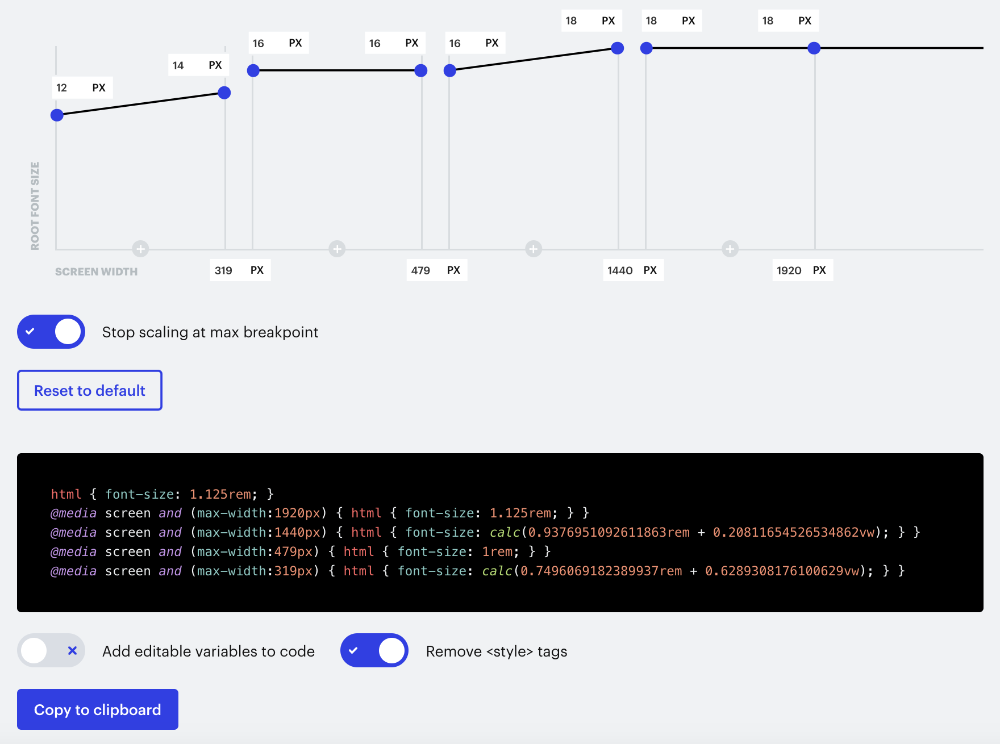

# Fluid Typography \[OLD]

In the S2 Framework, we adopted the fluid responsive CSS generated by the excellent [tool](https://finsweet.com/client-first/docs/fluid-responsive) made by the Client-First team. **In S2's default setup, we removed some unnecessary decimals for better performance.**


## Base text

By default, S2 uses the below configuration. You can generate a larger rem setup and replace the CSS in <mark style="color:green;">**Global Code**</mark> if it is more suitable for your website.

| Screen width     | 1rem equals to | Explanation                                                                                                                                                                           |
| ---------------- | -------------- | ------------------------------------------------------------------------------------------------------------------------------------------------------------------------------------- |
| ≤ 319px          | 12px - 14px    | Increase the chance your website’s responsiveness to survive on narrow devices.                                                                                                       |
| 320px to 479px   | 16px           | It is easier for site building when you have a constant value. Fluid size growing is not obvious at this range. Using 16px prevents zoom-in effect when visitors tap on input fields. |
| 480px to 1440px  | 16px - 18px    | Increase the rem value on larger screens for smooth and better readiness.                                                                                                             |
| 1441px to 1920px | 18px           | In most case, 18px should be good enough. You may increase this value.                                                                                                                |
| ≥ 1921px         | /              | Stop scaling at max breakpoint.                                                                                                                                                       |


This is how it looks like using the tool. The **\~px** you can see on top of the tool refers to how many px do 1rem equals at different screen widths.

<figure><figcaption><p>Screencapture of the CSS generator</p></figcaption></figure>

So, the Fluid Responsive code included by default in the S2 Framework is:

```css
html { font-size: 1.125rem; }
@media screen and (max-width:1920px) { html { font-size: 1.125rem; } }
@media screen and (max-width:1440px) { html { font-size: calc(0.937695rem + 0.208vw); } }
@media screen and (max-width:479px) { html { font-size: 1rem; } }
@media screen and (max-width:319px) { html { font-size: calc(0.749607rem + 0.629vw); } }
```


If you want a larger overall font size for your website, you may follow the below example.

<figure><figcaption><p>Larger overall font size</p></figcaption></figure>

```css
html { font-size: 1.25rem; }
@media screen and (max-width:1920px) { html { font-size: 1.25rem; } }
@media screen and (max-width:1440px) { html { font-size: calc(1.062695rem + 0.208vw); } }
@media screen and (max-width:479px) { html { font-size: 1.125rem; } }
@media screen and (max-width:319px) { html { font-size: calc(0.874607rem + 0.629vw); } }
```


## Headings

For headings, a modern concept of **Type Scale** is adopted in the S2 Framework. We can get the values easily by using the tool [Fluid Type Scale](https://www.fluid-type-scale.com).

The values have been applied to the tags <mark style="color:purple;">`Heading 1`</mark> to <mark style="color:purple;">`Heading 6`</mark>, and also to classes `h1` to `h6`. And, as sometimes you simply need smaller headings, there are `h7` and `h8`.

You can access our default config on the tool for headings [by visiting here](https://www.fluid-type-scale.com/calculate?minFontSize=16\&minWidth=360\&minRatio=1.24577245\&maxFontSize=18\&maxWidth=1280\&maxRatio=1.347625\&steps=h6%2Ch5%2Ch4%2Ch3%2Ch2%2Ch1\&baseStep=h6\&prefix=s2\&useContainerWidth=false\&includeFallbacks=true\&useRems=true\&remValue=16\&decimals=3\&previewFont=Inter\&previewText=Almost+before+we+knew+it%2C+we+had+left+the+ground\&previewWidth=1280).


`h6` is the baseline step, and it is the same as the root font size.


```css
--s2-h6: clamp(1rem, 0.217vi + 0.951rem, 1.125rem);
--s2-h5: clamp(1.246rem, 0.47vi + 1.14rem, 1.516rem);
--s2-h4: clamp(1.552rem, 0.854vi + 1.36rem, 2.043rem);
--s2-h3: clamp(1.933rem, 1.426vi + 1.613rem, 2.753rem);
--s2-h2: clamp(2.409rem, 2.264vi + 1.899rem, 3.71rem);
--s2-h1: clamp(3rem, 3.478vi + 2.218rem, 5rem);
```

The classes `h7` and `h8` are arbitrary classes invented to style smaller headings.

[Configurations to get the `clamp()` value for `h7` and `h8` classes](https://www.fluid-type-scale.com/calculate?minFontSize=13\&minWidth=360\&minRatio=1.125\&maxFontSize=14\&maxWidth=1280\&maxRatio=1.1595\&steps=h8%2Ch7\&baseStep=h7\&prefix=s2\&useContainerWidth=false\&includeFallbacks=true\&useRems=true\&remValue=16\&decimals=3\&previewFont=Inter\&previewText=Almost+before+we+knew+it%2C+we+had+left+the+ground\&previewWidth=1280)

```css
--s2-h8: clamp(0.722rem, 0.056vi + 0.71rem, 0.755rem);
--s2-h7: clamp(0.813rem, 0.109vi + 0.788rem, 0.875rem);
```

In the configuration, we get our desired max sizes 0.875rem and 0.755rem; and the min sizes are also within reasonable value.


## Superscript and Subscript

S2 adopted fluid font styles on `sup` and `sub` elements.

We prepare a **Fluid Sup / Sub CSS Generator**, modified from a tool created by [Lorenz Woehr](https://css-tricks.com/fluid-superscripts-and-subscripts/):  \
[https://codepen.io/realanthonyc/pen/emOXEMz](https://codepen.io/realanthonyc/pen/emOXEMz)

On the S2 Framework, the CSS styles are applied seamlessly to the Webflow Designer at the tag level. They look perfect!


Extended reading:








