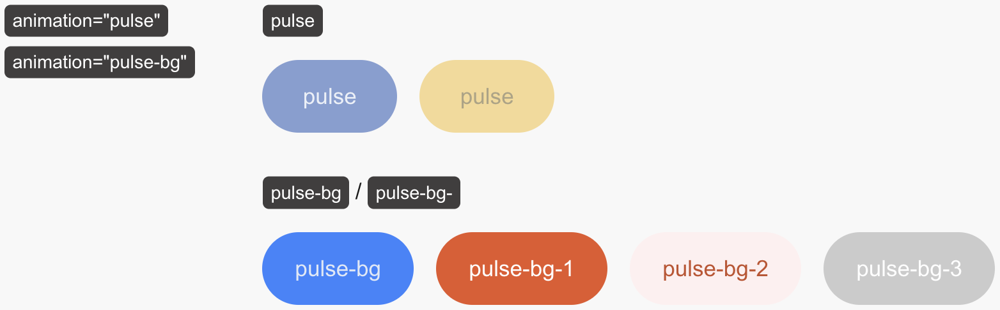

# S2 Framework Lite

The S2 Framework is lightweight and optimized for speed, SEO, and accessibility. However, if you are looking for an even lighter version, there are options:

1. **S2 Lite**: Keep the essential parts we recommend.
2. **S2 for Templates**: [Remove everything except the Style Guide](for-template-creators.md).


If you want to minimize the footprint of the S2 Framework, we generally recommend slimming down the style guide after you have completed most of your website design. The handcrafted styles and layouts in the Framework are always handy while you work on your project. 😊


## Steps to prepare a Lite version of the S2 Framework

**Follow these steps to create a Lite version of our recommendation:**

1. Delete these pages:
   * **"Filter UI"** page
   * **"S2 Components"** page
   * **"For Drafting"** page
2. Make the **"Home"** page your homepage:
   * Remove `DELETE-ME` from the Home page.
   * As the cover page of the style guide will become "Old Home", you can also delete that page.
3. Go to the **"Styles"** pages:
   * Remove **Filter UI**, and **S2 Components** nav links. You can also remove the color mode switch from the style guide's main navigation.
   * Add the `cc-last` combo class to the last nav link.
   * Remove the "**Mode Utilities**" section.
4. Go to the **"UI Elements"** page:
   1. Remove the whole "**Mode Switching**" section.
   2.  Remove the section that contains `animation="pulse"` and `animation="pulse-bg"`.

       <figure><figcaption></figcaption></figure>
5. Go to the **"Layouts"** page, and remove the **Grid Layout Utilities** section.
6. Open the <mark style="color:green;">**Global Code**</mark> component inside the `page` div, and remove these code embed elements:
   * `js`
   * `css-animations`
7. Go to the Variables panel, and remove **Dark mode** from the **Colors** variable collection.
8. Clean up all unused interactions.
9. Clean up all unused styles.
10. Go to **Site settings**, then **Custom code**, and remove all code from the _global_ **Head code** and **Footer code**. Remember to click "Save".

